<h2>TensorFlow-FlexUNet-Image-Segmentation-MU-Glioma-Post-T1N-Subset (2026/04/26)</h2>

Sarah T. Arai 
Software Laboratory antillia.com 
 
This is the first experiment of Image Segmentation for MU-Glioma-Post (University of Missouri Post-operative Glioma)-T1N-Subset,
 based on our 
TensorFlowFlexUNet (TensorFlow Flexible UNet Image Segmentation Model for Multiclass) 
and a 384x384 pixels upscaled PNG 
<a href="https://drive.google.com/file/d/1wIm2MLhnVZr70-mAE6Y_r_ZtzCAH4tfL/view?usp=sharing">
MU-Glioma-Post-T1N-ImageMask-Subset.zip
</a> (<a href="https://creativecommons.org/licenses/by/4.0/">CC BY 4.0</a>), 
which was derived by us from    
<a href="https://www.cancerimagingarchive.net/collection/mu-glioma-post/">
MU-Glioma-Post | University of Missouri Post-operative Glioma Dataset
</a>  on The Cancer Imaging Archive.
 
 
For comparion of actual segmentation between T1N and T2W MRI, please see also our T2W experiment <a href="https://github.com/sarah-antillia/TensorFlow-FlexUNet-Image-Segmentation-MU-Glioma-Post-T2W-Subset">
TensorFlow-FlexUNet-Image-Segmentation-MU-Glioma-Post-T2W-Subset</a>.
  

<b>Actual Image Segmentation for  MU-Glioma-Post-T1N-Subset Images of 384x384 pixels</b> 
As shown below, the inferred masks predicted by our segmentation model trained on the 
PNG dataset appear similar to the ground truth masks.  
<b>class_color_map={NETC:red, SNFH:green, ET:blue, RC:yellow} </b>
 
<table>
<tr>
<th>Input: image</th>
<th>Mask (ground_truth)</th>
<th>Prediction: inferred_mask</th>
</tr>
<tr>
<td>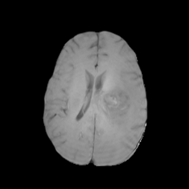</td>
<td>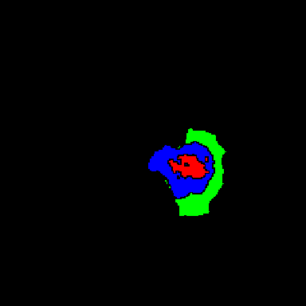</td>
<td>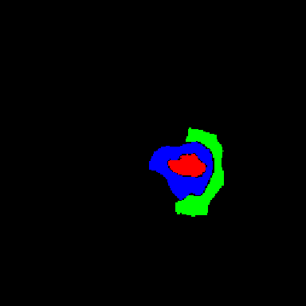</td>
</tr>
<tr>
<td>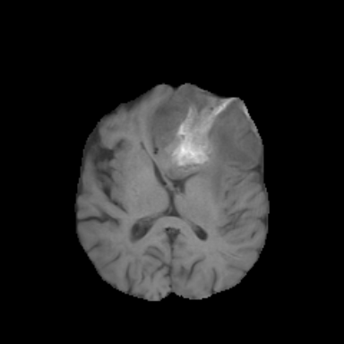</td>
<td></td>
<td>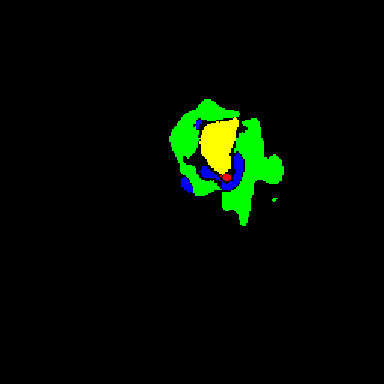</td>
</tr>
<tr>
<td>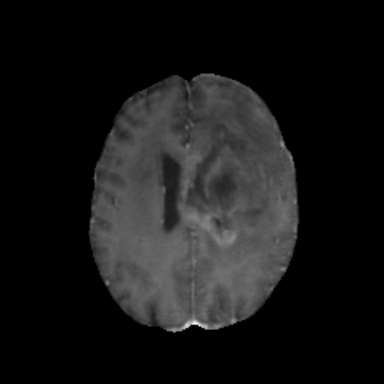</td>
<td>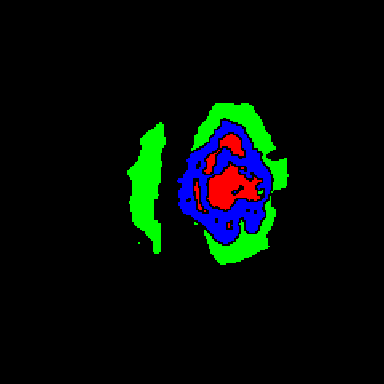</td>
<td>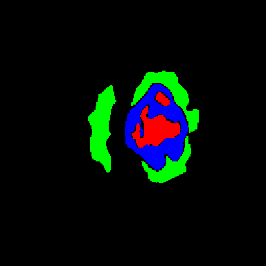</td>
</tr>
</table>

<h3>1. Dataset Citation</h3>
The dataset used here was derived from    
<a href="https://www.cancerimagingarchive.net/collection/mu-glioma-post/">
MU-Glioma-Post | University of Missouri Post-operative Glioma Dataset
</a>  on The Cancer Imaging Archive(TCIA).
 
 
The following explanation was taken from the TCIA web site.
  
<b>Abstract</b> 
This dataset includes MR imaging from 203 glioma patients with 596 different post-treatment MR time points, 
and tumor segmentations. 
Clinical data includes patient demographics, genomics, and treatment details.  
Preprocessing of MR images followed a standardized pipeline with automatic tumor segmentation based on 
nnUNet deep learning approach.  
The automatic tumor segmentations were manually validated and refined by neuroradiologists.
  
The heterogeneity of glioma imaging characteristics and management strategies contributes to a lack of 
reliable findings when evaluating treatment outcomes with conventional MRI, and 
the overlapping imaging features of radiation necrosis and tumor progression post-treatment 
can be particularly challenging for radiologists.  
This robust dataset should contribute to the development of AI models to improve evaluation of treatment outcomes. 
  
<b>Introduction</b> 
The dataset consists of institutional review board-approved retrospective analysis of pathologically proven glioma 
patients at University Hospital of The University of Missouri - Anatomic Pathology CoPathPlus database was 
used to collect glioma cases over the last 10 years.
  
Sharing segmented postoperative glioma data with clinical information significantly accelerates research 
and improves clinical practice by providing a comprehensive, readily available dataset.  
This eliminates the time-consuming burden of manual segmentation, enhances the accuracy and 
consistency of tumor delineation, and allows researchers to focus on analysis and interpretation, 
ultimately driving the development of more accurate segmentation algorithms, 
predictive models for personalized treatment strategies, and improved patient outcome predictions.
 Standardized longitudinal follow-up and benchmarking capabilities further facilitate multi-center 
 studies and objective evaluation of treatment efficacy, leading to advancements in glioma biology 
 and personalized patient care.
  
<b>Data Analysis</b> 
The image data underwent preprocessing using the Federated Tumor Segmentation (FeTS) tool. The pipeline began with converting DICOM files to the Neuroimaging Informatics Technology Initiative (NIfTI) format, ensuring the removal of any remaining PHI not eliminated by the anonymization/de-identification tool. The converted NIfTI images were then resampled to an isotropic 1mm³ resolution and co-registered to the standard anatomical human brain atlas, SRI24. A deep learning brain extraction method was applied to strip the skull and extracranial tissues, thereby mitigating any potential facial reconstruction or recognition risks.
  
The preprocessed images were segmented using a deep network based on nnU-Net, resulting in four distinct labels that correspond to different components of each tumor:

<ul>
<li><b>Label 1: Non-enhancing Tumor Core (NETC).</b> 
This label identifies non-enhancing components within the tumor, such as cystic, necrotic, or hemorrhagic portions.
</li>
<li><b>Label 2: Surrounding Non-enhancing FLAIR Hyperintensity (SNFH).</b>  
This label represents both non-enhancing infiltrative tumor components and peritumoral vasogenic edema.
</li>
<li><b>Label 3: Enhancing Tissue (ET).</b>  
This label highlights the viable nodular-enhancing components of the tumor.
</li>
<li><b>Label 4: Resection Cavity (RC).</b>  
This label covers post-surgical changes, including recent changes like blood products and air foci, as well as chronic changes with materials isointense to CSF signal. 
</li>
</ul>
 
<b>Citations & Data Usage Policy</b> 
 Data Citation Required: Users must abide by the 
<a href="https://www.cancerimagingarchive.net/data-usage-policies-and-restrictions/">TCIA Data Usage Policy and Restrictions</a>. 
Attribution must include the following citation, including the Digital Object Identifier:
  
<b>Data Citation</b> 
Yaseen, D., Garrett, F., Gass, J., Greaser, J., Isufi, E., Layfield, L. J., Nada, A., Porgorzelski, K., Sinclair, J., Tahon, N. H. M., & Thacker, J. (2025). 
 University of Missouri Post-operative Glioma Dataset (MU-Glioma-Post) (Version 1) [Data set].  
The Cancer Imaging Archive. https://doi.org/10.7937/7K9K-3C83
  
<b>License</b> 
<a href="https://creativecommons.org/licenses/by/4.0/">CC BY 4.0</a>
  
<h3>
<a id="2">
2 MU-Glioma-Post-T1N-Subset ImageMask Dataset
</a>
</h3>
<h4>2.1 Download ImageMask Dataset</h4>
 If you would like to train this MU-Glioma-Post-T1N-Subset Segmentation model by yourself,
 please download the dataset from the google drive 
<a href="https://drive.google.com/file/d/1wIm2MLhnVZr70-mAE6Y_r_ZtzCAH4tfL/view?usp=sharing">
MU-Glioma-Post-T1N-ImageMask-Subset.zip</a> (<a href="https://creativecommons.org/licenses/by/4.0/">CC BY 4.0</a>) , 
expand the downloaded dataset, and put it under <b>./dataset</b> folder to be:
<pre>
./dataset
└─MU-Glioma-Post-T1N-Subset
    ├─test
    │   ├─images
    │   └─masks
    ├─train
    │   ├─images
    │   └─masks
    └─valid
        ├─images
        └─masks
</pre>
 
<b>MU-Glioma-Post-T1N-Subset Statistics</b> 
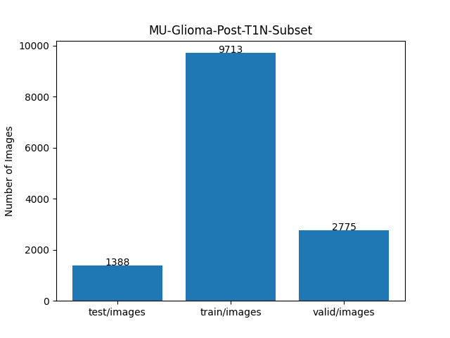 
 
As shown above, the number of images of train and valid datasets is large enough to use for a training set of our segmentation model.
 
 
<h4>2.2 Derivation of ImageMask Subset</h4>
The folder structure of <b>MU-Glioma-Post</b> is the following. 
<pre>
./MU-Glioma-Post
  ├─PatientID_0003
  │  ├─Timepoint_1
  │  │    ├─PatientID_0003_Timepoint_1_brain_t1c.nii.gz
  │  │    ├─PatientID_0003_Timepoint_1_brain_t1n.nii.gz
  │  │    ├─PatientID_0003_Timepoint_1_brain_t2f.nii.gz
  │  │    ├─PatientID_0003_Timepoint_1_brain_t1n.nii.gz
  │  │    └─PatientID_0003_Timepoint_1_tumorMask.nii.gz
  │  ├─Timepoint_2
          ...
  │  ├─Timepoint_3
  │  │    ├─PatientID_0003_Timepoint_3_brain_t1c.nii.gz
  │  │    ├─PatientID_0003_Timepoint_3_brain_t1n.nii.gz
  │  │    ├─PatientID_0003_Timepoint_3_brain_t2f.nii.gz
  │  │    ├─PatientID_0003_Timepoint_3_brain_t1n.nii.gz
  │  │    └─PatientID_0003_Timepoint_3_tumorMask.nii.gz
... 
  ├─PatientID_0004
...
  └─PatientID_0275
      ├─Timepoint_1
      │    ├─PatientID_0275_Timepoint_1_brain_t1c.nii.gz
      │    ├─PatientID_0275_Timepoint_1_brain_t1n.nii.gz
      │    ├─PatientID_0275_Timepoint_1_brain_t2f.nii.gz
      │    ├─PatientID_0275_Timepoint_1_brain_t1n.nii.gz
      │    └─PatientID_0275_Timepoint_1_tumorMask.nii.gz
      ├─Timepoint_3
          ...
      └─Timepoint_6
           ├─PatientID_0275_Timepoint_6_brain_t1c.nii.gz
           ├─PatientID_0275_Timepoint_6_brain_t1n.nii.gz
           ├─PatientID_0275_Timepoint_6_brain_t2f.nii.gz
           ├─PatientID_0275_Timepoint_6_brain_t1n.nii.gz
           └─PatientID_0275_Timepoint_6_tumorMask.nii.gz  

</pre>
We used a simple Python script and the following class-color-mapping table to generate our 384x384 pixels upscaled PNG 
<b>T1N (Native T1WI or Non-contrast T1WI) </b> Subset 
with colorized masks from  200 pairs of <b>*_brain_t1n.nii.gz</b> 
and corresponding <b>*_tumorMask.nii.gz</b> in <b>TimePoint_*</b> sub directories of 
<b>PaintID</b> directories. 
  
<table border="1" style="border-collapse: collapse;">

<tr><th>Index</th><th>Class (Category)</th><th>Color </th><th>RGB triplet</th></tr>
<tr>
<td>1</td><td>NETC (Non-enhancing tumor core)</td><td>red</td><td>(255,0,0)</td><tr>
<td>2</td><td>SNFH (Surrounding non-enhancing FLAIR hyperintensity)</td><td>green</td><td>(0,255,0)</td><tr>
<td>3</td><td>ET (Enhancing tissue)</td><td>blue</td><td>(0,0,255)</td><tr>
<td>4</td><td>RC (Resection cavity)</td><td>yellow</td><td>(255,255,0)</td><tr>
</table>
 
For simplicity, we excluded all empty black masks and their corresponding images to generate our PNG dataset, which were 
irrelevant to train our segmentation model, 
and upscaled all images and masks to 364x436 pixels from the original 182x218 pixels.
 

<h4>2.3 Image and Mask samples</h4>
<b>Train_images_sample</b> 
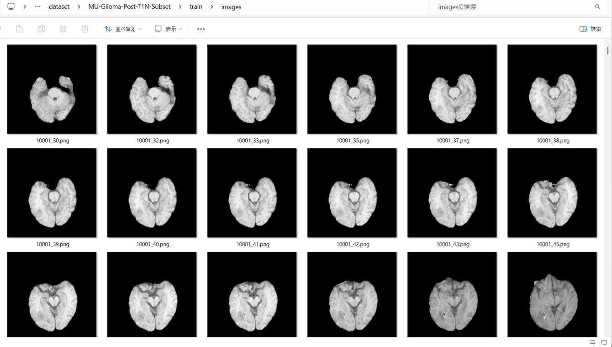
 
<b>Train_masks_sample</b> 
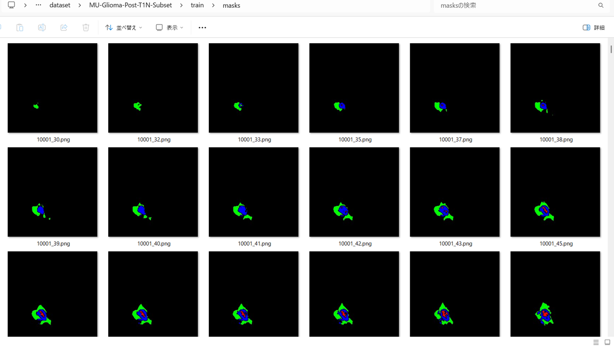
 
 
<h3>
3 Train TensorFlowFlexUNet Model
</h3>
 We trained MU-Glioma-Post-T1N-Subset TensorFlowFlexUNet Model by using the following
<a href="./projects/TensorFlowFlexUNet/MU-Glioma-Post-T1N-Subset/train_eval_infer.config"> <b>train_eval_infer.config</b></a> file.  
Please move to <b>./projects/TensorFlowFlexUNet/MU-Glioma-Post-T1N-Subset</b> foder, and run the following bat file. 
<pre>
>1.train.bat
</pre>
, which simply runs the following command. 
<pre>
>python ../../../src/TensorFlowFlexUNetTrainer.py ./train_eval_infer.config
</pre>

<b>Model parameters</b> 
Defined a small <b>base_filters = 16 </b> and large <b>base_kernels = (11,11)</b> for the first Conv Layer of Encoder Block of 
<a href="./src/TensorFlowFlexUNet.py">TensorFlowFlexUNet.py</a> 
and a large <b>num_layers = 8</b> (including a bridge between Encoder and Decoder Blocks).
<pre>
[model]
;You may specify your own UNet class derived from our TensorFlowFlexModel
model         = "TensorFlowFlexUNet"
generator     =  False
image_width    = 256
image_height   = 256
image_channels = 3
num_classes    = 5
base_filters   = 16
base_kernels   = (11,11)
num_layers     = 8
dropout_rate   = 0.05
dilation       = (1,1)
</pre>
<b>Learning rate</b> 
Defined a very small learning rate.  
<pre>
[model]
learning_rate  = 0.00007
</pre>
<b>Loss and metrics functions</b> 
Specified "categorical_crossentropy" and <a href="./src/dice_coef_multiclass.py">"dice_coef_multiclass"</a>. 
<pre>
[model]
loss           = "categorical_crossentropy"
metrics        = ["dice_coef_multiclass"]
</pre>
<b>Dataset class</b> 
Specifed <a href="./src/ImageCategorizedMaskDataset.py">ImageCategorizedMaskDataset</a> class. 
<pre>
[dataset]
class_name    = "ImageCategorizedMaskDataset"
</pre>
 
<b>Learning rate reducer callback</b> 
Enabled learing_rate_reducer callback, and a small reducer_patience.
<pre> 
[train]
learning_rate_reducer = True
reducer_factor     = 0.5
reducer_patience   = 4
</pre>
<b>Early stopping callback</b> 
Enabled early stopping callback with patience parameter.
<pre>
[train]
patience      = 10
</pre>

<b>RGB Color map</b> 
rgb color map dict for MU-Glioma-Post-T1N-Subset 1+4 classes. 
<pre>
[mask]
mask_datatyoe    = "categorized"
mask_file_format = ".png"
;                     NCR:red,    ED:green,    ET:blue,    RC: yellow    
rgb_map = {(0,0,0):0,(255,0,0):1,(0,255,0):2, (0,0,255):3,(255,255,0):4 }
</pre>

<b>Epoch change inference callback</b> 
Enabled <a href="./src/EpochChangeInfereuncer.py">epoch_change_infer callback</a></b>. 
<pre>
[train]
epoch_change_infer       = True
epoch_change_infer_dir   =  "./epoch_change_infer"
num_infer_images         = 6
</pre>

By using this callback, on every epoch_change, the inference procedure can be called
 for 6 images in <b>mini_test</b> folder. This will help you confirm how the predicted mask changes 
 at each epoch during your training process.    

<b>Epoch_change_inference output at starting (epoch 1,2,3)</b> 
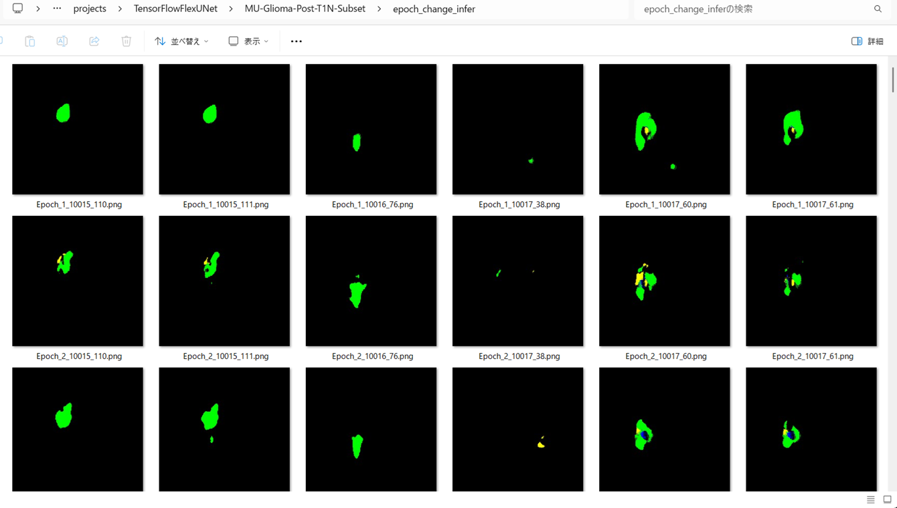 
 
<b>Epoch_change_inference output at middlepoint (epoch 23,24,25)</b> 
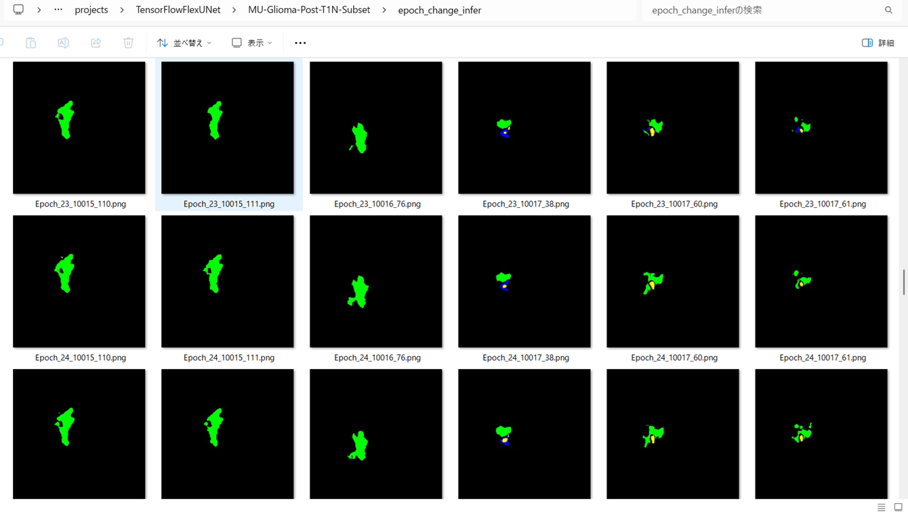 
 
<b>Epoch_change_inference output at ending (epoch 48,49,50)</b> 
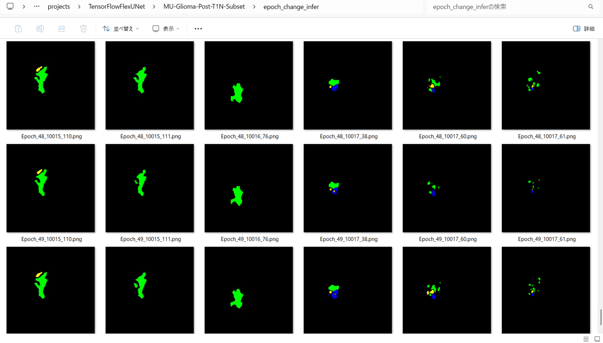 
 
In this experiment, the training process was terminated at epoch 50.  
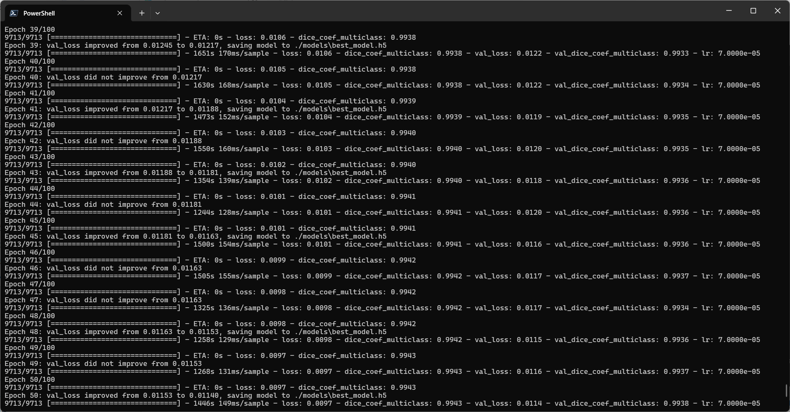 
 

<a href="./projects/TensorFlowFlexUNet/MU-Glioma-Post-T1N-Subset/eval/train_metrics.csv">train_metrics.csv</a> 
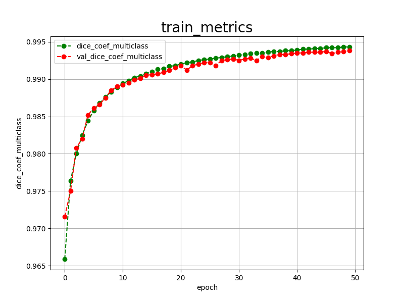 

 
<a href="./projects/TensorFlowFlexUNet/MU-Glioma-Post-T1N-Subset/eval/train_losses.csv">train_losses.csv</a> 
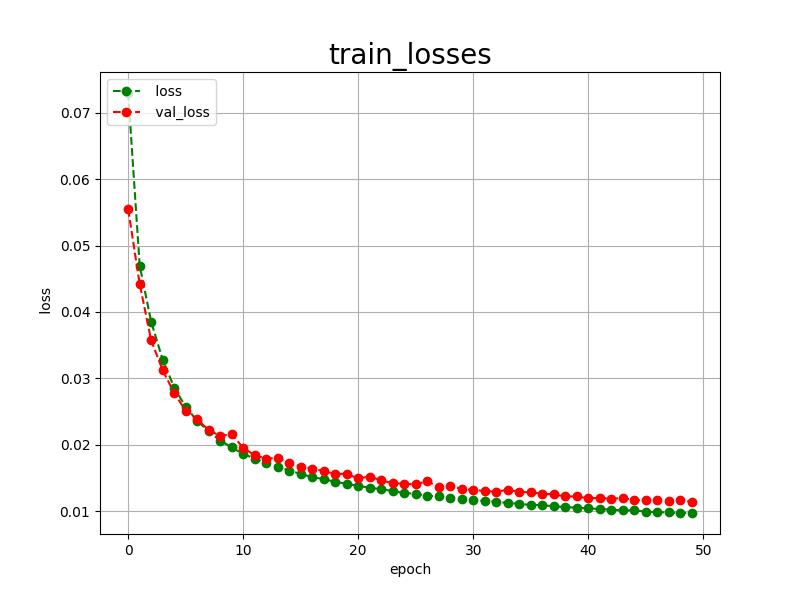 

 
<h3>
4 Evaluation
</h3>
Please move to <b>./projects/TensorFlowFlexUNet/MU-Glioma-Post-T1N-Subset</b> folder, 
and run the following bat file to evaluate TensorFlowFlexUNet model for MU-Glioma-Post-T1N-Subset. 
<pre>
>./2.evaluate.bat
</pre>
This bat file simply runs the following command.
<pre>
>python ../../../src/TensorFlowFlexUNetEvaluator.py ./train_eval_infer.config
</pre>

Evaluation console output: 
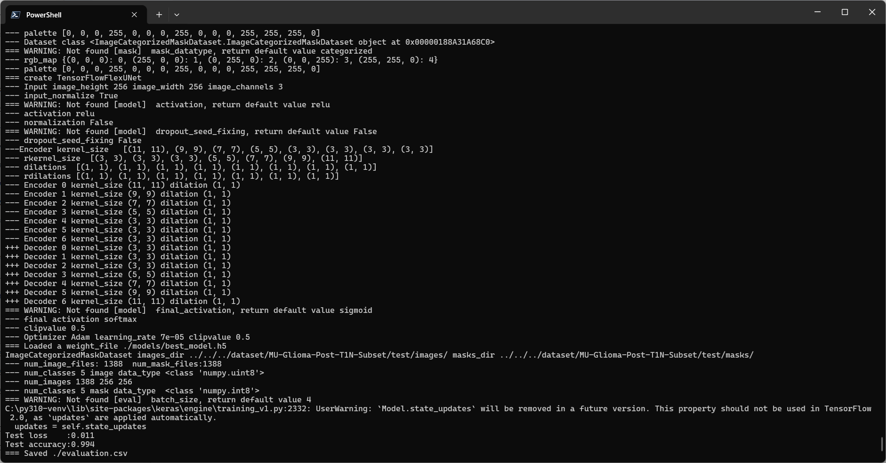
  

<a href="./projects/TensorFlowFlexUNet/MU-Glioma-Post-T1N-Subset/evaluation.csv">evaluation.csv</a> 
The loss (categorical_crossentropy) to this MU-Glioma-Post-T1N-Subset/test was very low, and dice_coef_multiclass very high as shown below.
 
<pre>
categorical_crossentropy,0.0086
dice_coef_multiclass,0.9953
</pre>
 

<h3>
5 Inference
</h3>
Please move <b>./projects/TensorFlowFlexUNet/MU-Glioma-Post-T1N-Subset</b> folder, and run the following bat file to infer segmentation regions for images by the Trained-TensorFlowFlexUNet model for MU-Glioma-Post-T1N-Subset. 
<pre>
>./3.infer.bat
</pre>
This simply runs the following command.
<pre>
>python ../../../src/TensorFlowFlexUNetInferencer.py ./train_eval_infer.config
</pre>

<b>mini_test_images</b> 
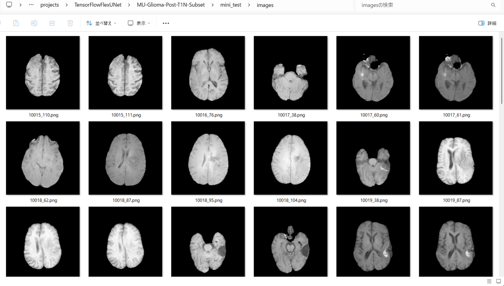 
<b>mini_test_mask(ground_truth)</b> 
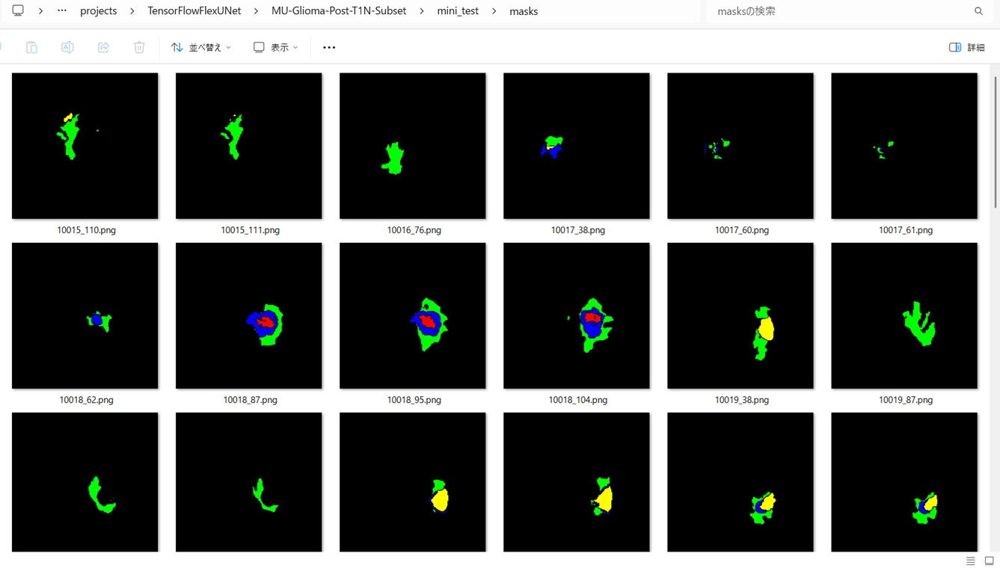 

<b>Inferred test masks</b> 
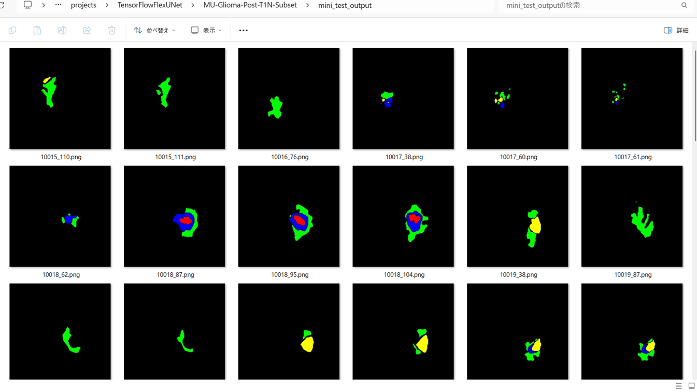 
 

<b>Enlarged images and masks for  MU-Glioma-Post-T1N-Subset Images of 384x384 pixels</b> 
As shown below, the inferred masks predicted by our segmentation model trained on the 
PNG dataset appear similar to the ground truth masks.  
<b>class_color_map={NETC:red, SNFH:green, ET:blue, RC:yellow} </b>
<table>
<tr>
<th>Input: Image</th>
<th>Mask (ground_truth)</th>
<th>Prediction: Inferred-mask</th>
</tr>
<tr>
<td>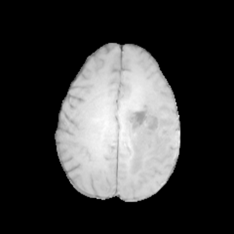</td>
<td>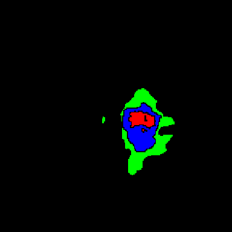</td>
<td>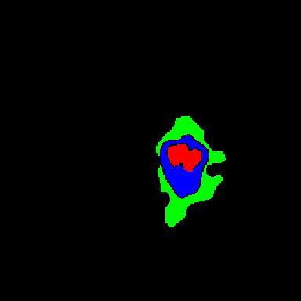</td>
</tr>
<tr>
<td>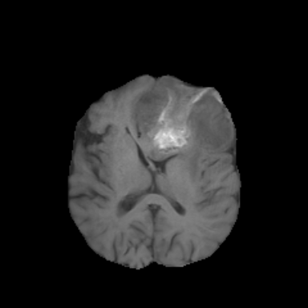</td>
<td>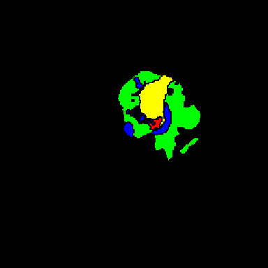</td>
<td>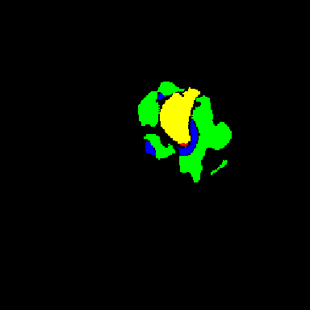</td>
</tr>
<tr>
<td>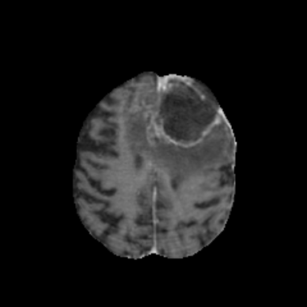</td>
<td>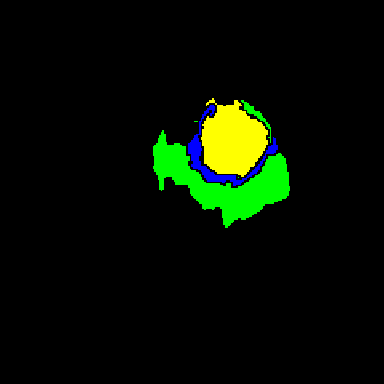</td>
<td>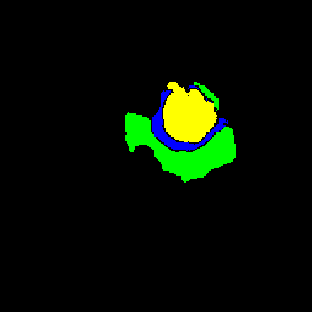</td>
</tr>
<tr>
<td>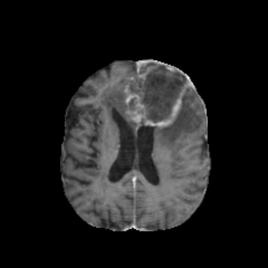</td>
<td>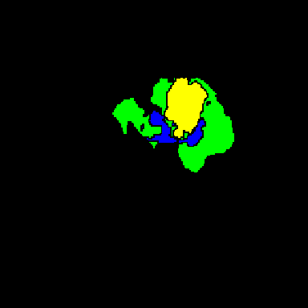</td>
<td></td>
</tr>
<tr>
<td>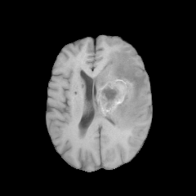</td>
<td>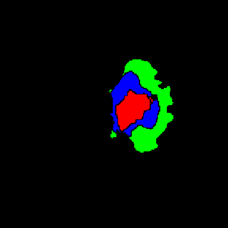</td>
<td>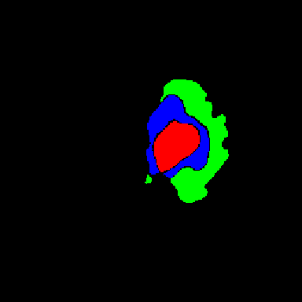</td>
</tr>
<tr>
<td>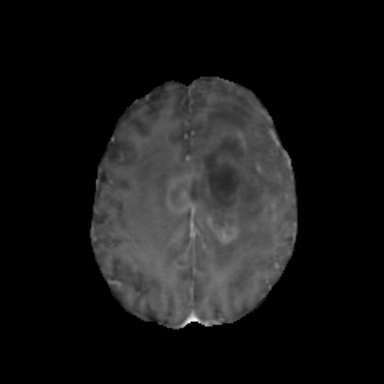</td>
<td>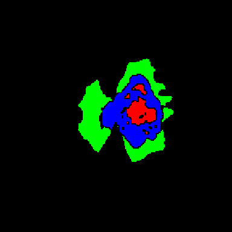</td>
<td>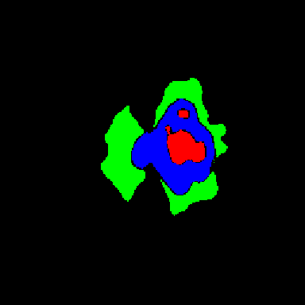</td>
</tr>
</table>

 
<h3>
6 3D Volume Segmentation
</h3>
Please move <b>./projects/TensorFlowFlexUNet/MU-Glioma-Post-T1N-Subset</b> folder, and run the following bat file to infer images segmentation for 2D slices of 3D volume NIfTI files
 by the Trained-TensorFlowFlexUNet model for MU-Glioma-Post-T1N-Subset. 
<pre>
>./5.infer3d.bat
</pre>
This simply runs the following command.
<pre>
>python ../../../src/TensorFlowFlexUNet3DInferencer.py ./train_eval_infer.config
</pre>

<b>infer3d section </b> in <a href="./projects/TensorFlowFlexUNet/MU-Glioma-Post-T1N-Subset/train_eval_infer.config">
train_eval_infer.config
<a></b>
<pre>
[infer3d] 
;Specify an images_dir which contains NIfTI files
images_dir    = "./mini_test_3d/images/"
output_dir    = "./mini_test_3d_output/"
slice_shape_order = "hwd"
slice_resize   = (384,384)
slice_rotation = cv2.ROTATE_90_CLOCKWISE 
mask_overlay  = True
</pre>

<b>Actual Image Segmentation for 2D Slices of a MU-Glioma-Post T1N NIfTI</b> 
Some Slices, Inferred Masks and Mask overlays for a 3D volume <b>PatientID_0025_Timepoint_1_brain_t1n.nii.gz</b> file.
 
As shown below, the Predictions and MaskOverlays of the first and second slices are different from those of T2W cases in 
 <a href="https://github.com/sarah-antillia/TensorFlow-FlexUNet-Image-Segmentation-MU-Glioma-Post-T2W-Subset">
TensorFlow-FlexUNet-Image-Segmentation-MU-Glioma-Post-T2W-Subset</a>.
  
<b>class_color_map={NETC:red, SNFH:green, ET:blue, RC:yellow} </b>
 
<table>
<tr>
<th>Input: Slice</th>
<th>Prediction: Inferred mask</th>
<th>Mask Overlay</th>
</tr>
<tr>
<td>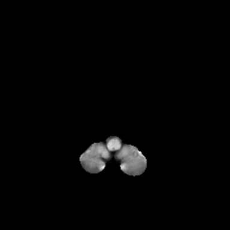</td>
<td></td>
<td></td>
</tr>
<tr>
<td>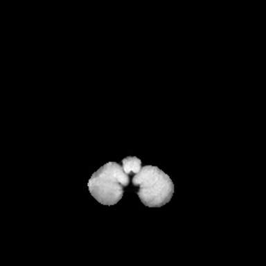</td>
<td></td>
<td>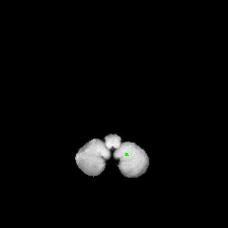</td>
</tr>
<tr>
<td>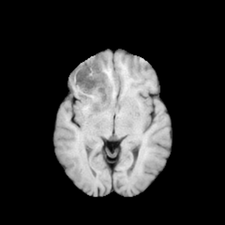</td>
<td>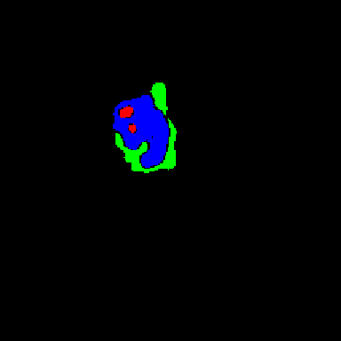</td>
<td>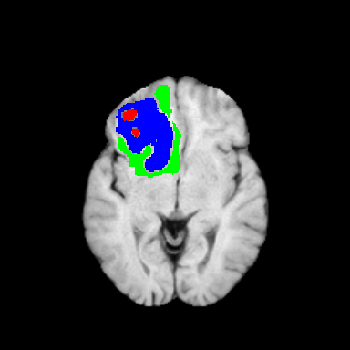</td>
</tr>
<tr>
<td>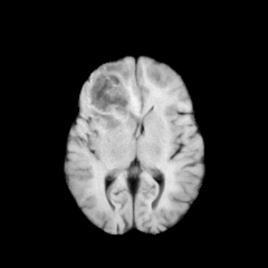</td>
<td>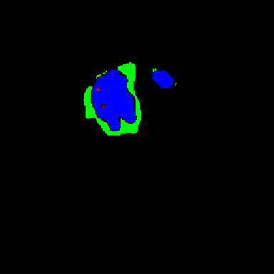</td>
<td>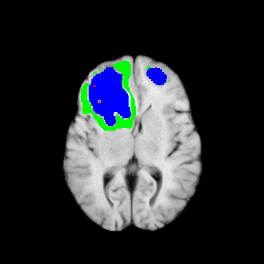</td>
</tr>
<tr>
<td>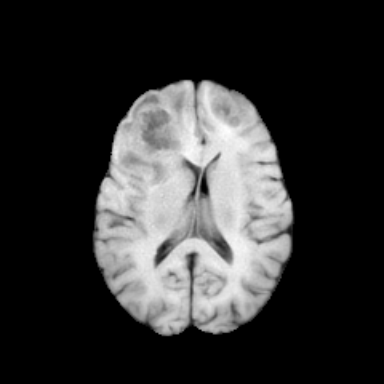</td>
<td>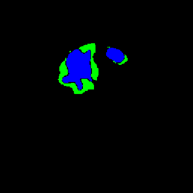</td>
<td>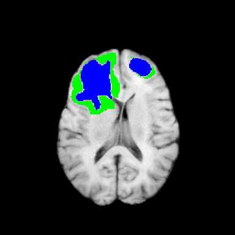</td>
</tr>
<tr>
<td>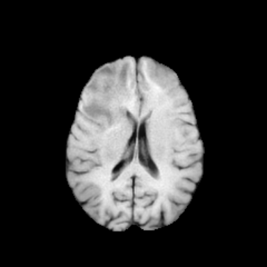</td>
<td>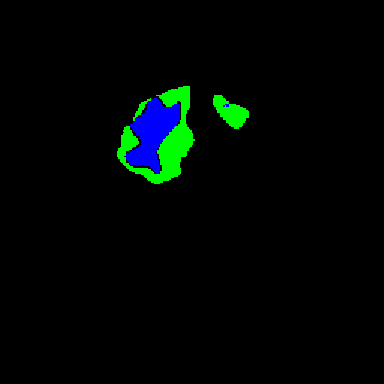</td>
<td>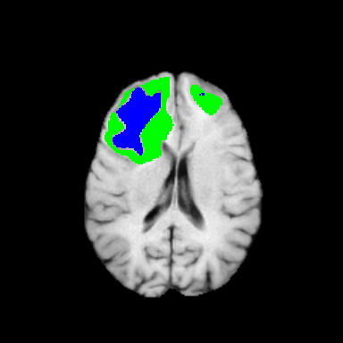</td>
</tr>
</table>

<h3>
7 MaskOverlay Video of 3D Volume Segmentation
</h3>
Please move <b>./projects/TensorFlowFlexUNet/MU-Glioma-Post-T1N-Subset</b> folder, and run the following bat file to generate
 MaskOverlay mp4 video of 3D Volume Segmentation.
to generate an overlays.mp4 file. 
<pre>
>./6.video3d.bat
</pre>
This simply runs the following command.
<pre>
>python ../../../src/MaskOverlayVideoGenerator.py ./train_eval_infer.config
</pre>
 
<video  src="./projects\TensorFlowFlexUNet/MU-Glioma-Post-T1N-Subset/video_3d/overlays.mp4" 
 controls="controls" 
width="384" height="384">

</video>

 
 
<h3>
References
</h3>
<b>1. Multi-class glioma segmentation on real-world data with missing MRI sequences: comparison of three deep learning algorithms
</b> 
Hugh G. Pemberton, Jiaming Wu, Ivar Kommers, Domenique M. J. Müller, Yipeng Hu, Olivia Goodkin,  
Sjoerd B. Vos, Sotirios Bisdas, Pierre A. Robe, Hilko Ardon, Lorenzo Bello, Marco Rossi,  
Tommaso Sciortino, Marco Conti Nibali, Mitchel S. Berger, Shawn L. Hervey-Jumper, Wim Bouwknegt, 
 Wimar A. Van den Brink, Julia Furtner, Seunggu J. Han, Albert J. S. Idema, Barbara Kiesel, 
  Georg Widhalm, Alfred Kloet, Michiel Wagemakers, Aeilko H. Zwinderman, Sandro M. Krieg,  
  Emmanuel Mandonnet, Ferran Prados, Philip de Witt Hamer, Frederik Barkhof & Roelant S. Eijgelaar 
<a href="https://www.nature.com/articles/s41598-023-44794-0">
https://www.nature.com/articles/s41598-023-44794-0
</a>
 
 
<b>2. Advancing Precision: A Comprehensive Review of MRI Segmentation Datasets from BraTS Challenges (2012–2025)</b> 
Beatrice Bonato, Loris Nanni and Alessandra Bertoldo 
<a href="https://www.mdpi.com/1424-8220/25/6/1838">https://www.mdpi.com/1424-8220/25/6/1838</a>
 
 
<b>3. MU-Glioma Post: A comprehensive dataset of automated MR multi-sequence segmentation and clinical features</b> 
Esmat Mahmoud, Jaime Gass, Yaseen Dhemesh, Josh Greaser, Karolina Pogorzelski, Edvin Isufi, Filip Garrett,  
Jonathan Thacker, Nourel hoda Tahon, Jason Sinclair, Lester Layfield, Talissa Altes & Ayman Nada 
<a href="https://www.nature.com/articles/s41597-025-06011-7">https://www.nature.com/articles/s41597-025-06011-7</a>
 
 
<b>4. TensorFlow-FlexUNet-Image-Segmentation-BraTS2024-Post-Treatment-Glioma-T2W-Subset</b> 
Toshiyuki Arai 
<a href="https://github.com/sarah-antillia/TensorFlow-FlexUNet-Image-Segmentation-BraTS2024-Post-Treatment-Glioma-T2W-Subset">
https://github.com/sarah-antillia/TensorFlow-FlexUNet-Image-Segmentation-BraTS2024-Post-Treatment-Glioma-T2W-Subset
</a>
 
 
<b>5. TensorFlow-FlexUNet-Image-Segmentation-UTSW-Glioma-T2W-Subset</b> 
Toshiyuki Arai 
<a href="https://github.com/sarah-antillia/TensorFlow-FlexUNet-Image-Segmentation-UTSW-Glioma-T2W-Subset">
https://github.com/sarah-antillia/TensorFlow-FlexUNet-Image-Segmentation-UTSW-Glioma-T2W-Subset
</a>
 
 
<b>6. TensorFlow-FlexUNet-Image-Segmentation-BraTS-Africa-Glioma-T2W</b> 
Toshiyuki Arai 
<a href="https://github.com/sarah-antillia/TensorFlow-FlexUNet-Image-Segmentation-BraTS-Africa-Glioma-T2W">
https://github.com/sarah-antillia/TensorFlow-FlexUNet-Image-Segmentation-BraTS-Africa-Glioma-T2W
</a>
 
 
<b>7. TensorFlow-FlexUNet-Image-Segmentation-Model</b> 
Toshiyuki Arai 
<a href="https://github.com/sarah-antillia/TensorFlow-FlexUNet-Image-Segmentation-Model">
https://github.com/sarah-antillia/TensorFlow-FlexUNet-Image-Segmentation-Model
</a>
  
<b>8. TensorFlow-FlexUNet-Image-Segmentation-MICCAI-FeTS2021-T2W-Subset</b> 
Toshiyuki Arai 
<a href="https://github.com/sarah-antillia/TensorFlow-FlexUNet-Image-Segmentation-MICCAI-FeTS2021-T2W-Subset">
https://github.com/sarah-antillia/TensorFlow-FlexUNet-Image-Segmentation-MICCAI-FeTS2021-T2W-Subset
</a>
 
 
<b>9. TensorFlow-FlexUNet-Image-Segmentation-Multiclass-BraTS2020</b> 
Toshiyuki Arai 
<a href="https://github.com/sarah-antillia/TensorFlow-FlexUNet-Image-Segmentation-Multiclass-BraTS2020">
https://github.com/sarah-antillia/TensorFlow-FlexUNet-Image-Segmentation-Multiclass-BraTS2020
</a>

